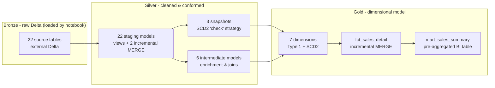

# AdventureWorks — Databricks Medallion Lakehouse with dbt

An end-to-end, production-shaped implementation of the **AdventureWorks 2025** sample database as a **Bronze → Silver → Gold medallion lakehouse** on **Databricks Free Edition**, built with **dbt Core** and the **dbt-databricks** adapter.

This project is built to reflect patterns commonly used in real-world data warehouses, including a Kimball star schema, SCD Type 2 history, incremental `MERGE` loads, a data-quality test suite, and environment-specific schema isolation. The goal is to showcase the kinds of design and engineering decisions you would typically encounter in a production analytics platform.

---

## What this project demonstrates

| Capability | Where it shows up |
|------------|-------------------|
| **Medallion architecture** | `models/bronze` (sources) → `models/silver` (staging + intermediate) → `models/gold` (dims, facts, marts) |
| **Dimensional modelling (Kimball)** | 7 conformed dimensions, a fact at sales-order-line grain, a pre-aggregated BI mart |
| **Slowly Changing Dimensions (Type 2)** | dbt snapshots + SCD2 dimensions for Product, Employee, SalesTerritory, with surrogate/business-key separation and an "Unknown member" safety net |
| **Point-in-time attribution** | Fact joins to the dimension version that was current when each order was placed |
| **Incremental processing** | `MERGE`-based incremental models for high-volume order header/detail and the fact table |
| **Advanced modelling patterns** | Junk dimension for low-cardinality flags, allocated semi-additive measures (freight/tax) at line grain |
| **Testing as a data contract** | 558 tests — built-ins, `dbt_utils`, `dbt_expectations`, a custom SCD2 overlap test, and singular reconciliation tests |
| **Engineering for multiple environments** | Custom `generate_schema_name` macro isolates `dev`, `ci`, and `prod` into separate schemas without collisions |
| **Self-bootstrapping ingestion** | A single Databricks notebook downloads the raw CSVs and lands them as Delta in Bronze |
| **Jobs & CI/CD** | Databricks Asset Bundle with a 4-job orchestration hierarchy, deployed by GitHub Actions with a gated prod release |
| **Observability & docs** | `on-run-start`/`on-run-end` hooks, `persist_docs` to Unity Catalog, and a browsable `dbt docs` lineage site |

---

## Architecture



| Layer | Contents | Materialisation |
|-------|----------|-----------------|
| **Bronze** | 22 source tables | external Delta (loaded by `bronze_bootstrap.ipynb`) |
| **Silver** | 22 staging + 6 intermediate | `view` + 2 incremental `MERGE` (`stg_sales_order_header`, `stg_sales_order_detail`) |
| **Snapshots** | 3 (Product, Employee, SalesTerritory) | dbt snapshot, `check` strategy |
| **Gold** | 7 dims, 1 fact, 1 mart | `table` + incremental `MERGE` on the fact |
| **Tests** | 558 | built-in + `dbt_utils` + `dbt_expectations` + 1 custom + 3 singular |

---

## Tech stack

- **dbt Core** with the **dbt-databricks** adapter (tested on dbt-core 1.11 / dbt-databricks 1.12; `dbt-databricks>=1.10` is recommended)
- **Databricks Free Edition** — serverless SQL warehouse + Unity Catalog
- **Delta Lake** storage format throughout
- dbt packages: [`dbt_utils`](https://github.com/dbt-labs/dbt-utils), [`dbt_expectations`](https://github.com/calogica/dbt-expectations), [`codegen`](https://github.com/dbt-labs/dbt-codegen)

---

## Project structure

```text
adventureworks-databricks-medallion-dbt/
├── dbt_project.yml          # project config, materialisations, persist_docs, hooks
├── packages.yml             # dbt_utils, dbt_expectations, codegen
├── profiles.yml             # committed to the repo — all values use env_var(), no secrets hard-coded
├── macros/
│   ├── generate_schema_name.sql      # dev/ci/prod schema isolation
│   └── test_scd2_no_date_overlap.sql # custom SCD2 integrity test
├── models/
│   ├── bronze/              # _sources_*.yml only (Bronze is loaded by notebook)
│   ├── silver/
│   │   ├── staging/         # 1:1 cleaned views over sources
│   │   └── intermediate/    # joins & enrichment
│   └── gold/
│       ├── dimensions/      # 7 dims (Type 1 + SCD2)
│       ├── facts/           # fct_sales_detail
│       └── marts/           # mart_sales_summary
├── snapshots/               # SCD2 snapshots for Product/Employee/SalesTerritory
├── tests/                   # singular (cross-model) tests
├── notebooks/
│   ├── bronze_bootstrap.ipynb   # downloads CSVs → lands Bronze Delta tables
│   ├── run_dbt.ipynb            # runs `dbt build` from a Databricks Job
│   └── scd_data_generator.ipynb # mutates source rows to exercise SCD2
├── databricks.yml           # Databricks Asset Bundle descriptor (4 jobs)
├── resources/               # *.job.yml definitions globbed by the bundle
├── .github/workflows/
│   └── databricks-bundle.yml        # CI/CD: validate + deploy the bundle
└── docs/
    ├── databricks-jobs-ui.md           # wire the 4 jobs up by hand (Workflows UI)
    ├── databricks-asset-bundle.md      # deploy the 4 jobs via the Databricks CLI
    └── databricks-cicd-github-actions.md # GitHub Actions CI/CD design & setup
```

---

## Getting started

**Prerequisites:** a free [Databricks Free Edition](https://www.databricks.com/learn/free-edition) account (includes a serverless SQL warehouse and Unity Catalog), [Python](https://www.python.org/downloads/) 3.10–3.13, and Git.

### 1. Collect your Databricks connection details

In your workspace:

1. Open your SQL Warehouse (the default serverless one is fine) → **Connection details** and record the **Server hostname** (e.g. `dbc-xxxxxxxx-xxxx.cloud.databricks.com` — no `https://`, no trailing `/`) and the **HTTP path** (e.g. `/sql/1.0/warehouses/abc123def456`).
2. Create a **Personal Access Token**: **Avatar → Settings → Developer → Access tokens → Generate new token**. Copy the `dapi…` value immediately — it is only displayed once.

### 2. Clone, create a venv, install dbt

Install only the adapter — it pulls in the matching `dbt-core` automatically.

**Windows PowerShell**

```powershell
git clone https://github.com/hjtc365/adventureworks-databricks-medallion-dbt.git
cd adventureworks-databricks-medallion-dbt
py -3.12 -m venv .venv
.\.venv\Scripts\Activate.ps1
pip install "dbt-databricks==1.12.*"
dbt deps
```

> If PowerShell blocks the activate script, relax the policy for the current
> session only: `Set-ExecutionPolicy -Scope Process -ExecutionPolicy RemoteSigned`.

**macOS / Linux**

```bash
git clone https://github.com/hjtc365/adventureworks-databricks-medallion-dbt.git
cd adventureworks-databricks-medallion-dbt
python3.12 -m venv .venv
source .venv/bin/activate
pip install "dbt-databricks==1.12.*"
dbt deps
```

`dbt deps` downloads `dbt_utils`, `dbt_expectations`, and `codegen` into `dbt_packages/` (git-ignored).

### 3. Connection config — nothing to edit

[`profiles.yml`](profiles.yml) is committed at the repo root and is safe to be there: every sensitive value is read from an environment variable at runtime via dbt's `env_var()` function.

```yaml
adventureworks:
  target: dev
  outputs:
    dev:
      type: databricks
      catalog: adventureworks_dev
      schema: default
      host: "{{ env_var('DBT_DBX_HOST') }}"
      http_path: "{{ env_var('DBT_DBX_HTTP_PATH') }}"
      token: "{{ env_var('DBT_DBX_TOKEN') }}"
      threads: 4
    prod:
      type: databricks
      catalog: adventureworks_prod
      schema: default
      host: "{{ env_var('DBT_DBX_HOST') }}"
      http_path: "{{ env_var('DBT_DBX_HTTP_PATH_PROD') }}"
      token: "{{ env_var('DBT_DBX_TOKEN') }}"
      threads: 8
```

dbt finds `profiles.yml` in the current working directory before falling back to `~/.dbt/`, so running dbt from the repo root needs no `--profiles-dir` flag. The only difference between `dev` and `prod` is the **Unity Catalog catalog**, so dev experiments never touch production data.

### 4. Set the environment variables

Replace the placeholders with the values from Step 1. `DBT_USER` is your developer prefix — the `generate_schema_name` macro uses it to name your dev schemas (e.g. `alice` → `alice_silver`), so multiple developers never collide in the shared dev catalog.

**Windows PowerShell**

```powershell
$env:DBT_DBX_HOST           = "dbc-xxxxxxxx-xxxx.cloud.databricks.com"
$env:DBT_DBX_HTTP_PATH      = "/sql/1.0/warehouses/abc123def456"
$env:DBT_DBX_HTTP_PATH_PROD = "/sql/1.0/warehouses/abc123def456"
$env:DBT_DBX_TOKEN          = "dapiXXXXXXXXXXXXXXXXXXXXXXXXXXXXXXXX"
$env:DBT_USER               = "alice"
```

**macOS / Linux**

```bash
export DBT_DBX_HOST="dbc-xxxxxxxx-xxxx.cloud.databricks.com"
export DBT_DBX_HTTP_PATH="/sql/1.0/warehouses/abc123def456"
export DBT_DBX_HTTP_PATH_PROD="/sql/1.0/warehouses/abc123def456"
export DBT_DBX_TOKEN="dapiXXXXXXXXXXXXXXXXXXXXXXXXXXXXXXXX"
export DBT_USER="alice"
```

These set the variables for the current shell only. To persist them, use `[Environment]::SetEnvironmentVariable('NAME', 'value', 'User')` on Windows, or add the `export` lines to `~/.bashrc` / `~/.zshrc`.

> **Never commit your token.** If a PAT is ever exposed, rotate it immediately in Databricks — git history retains old values forever.

Then verify the connection:

```bash
dbt debug
```

You want `All checks passed!`. *"Env var required but not provided"* means the variables aren't set in the current shell.

### 5. Load the Bronze layer (one-time)

dbt does **not** own ingestion — Bronze is loaded by a notebook. Import `notebooks/bronze_bootstrap.ipynb` into your Databricks workspace, set its `catalog` widget to `adventureworks_dev`, and run it. It creates the catalog, the `bronze` schema, and a `landing` volume, then downloads the AdventureWorks CSV exports and lands them as external Delta tables (all columns as `STRING` — typing happens in Silver).

> Optional: `notebooks/scd_data_generator.ipynb` mutates a few source rows so you can watch SCD2 snapshots capture history on subsequent runs.

### 6. Build and test the warehouse

```bash
dbt build
```

`dbt build` runs every model **and** its tests in dependency order, stopping a branch as soon as an upstream test fails. On success, all Silver and Gold models materialise into your `<DBT_USER>_silver` / `<DBT_USER>_gold` schemas, followed by ~558 passing tests.

Useful variations:

```bash
dbt build --select gold                 # just the Gold layer + its tests
dbt build --select +fct_sales_detail    # the fact and everything it depends on
dbt test                                # run the test suite only
dbt build --target prod                 # build into the prod catalog
```

---

## Multi-environment schema isolation

The custom `macros/generate_schema_name.sql` routes every model into an environment-specific schema so `dev`, `ci`, and `prod` never collide:

| Target | Schema pattern | Example |
|--------|----------------|---------|
| `dev` | `<DBT_USER>_<layer>` | `alice_silver`, `alice_gold` |
| `ci` | `pr_<PR_NUMBER>_<layer>` | `pr_42_silver` |
| `prod` | `<layer>` (no prefix) | `silver`, `gold` |

This is what lets a whole team share one `adventureworks_dev` catalog, and what makes pull-request CI builds disposable (drop `pr_42_*` after merge).

---

## Automating builds with Databricks Jobs

The two notebooks (`bronze_bootstrap` and `run_dbt`) are wired together as **four Databricks Jobs** — two leaf jobs wrapping the notebooks, a pipeline job that chains them for one environment, and an orchestrator that fans the pipeline out across environments:

```text
environment-orchestrator       for_each environments = ["dev", "prod"]
└── environment-pipeline       (param: environment)
    ├── bronze-bootstrap       (param: catalog = adventureworks_<env>)
    └── run-dbt                (param: target  = <env>)
```

Running **environment-orchestrator** once loads `dev` and `prod` end to end. There are two ways to create the jobs — pick whichever fits your workflow:

| Approach | When to use it | Guide |
|----------|----------------|-------|
| **Workflows UI** | One-off setup, learning the moving parts, no CLI required | **[docs/databricks-jobs-ui.md](docs/databricks-jobs-ui.md)** |
| **Databricks Asset Bundle** | Version-controlled, reproducible across workspaces, CI/CD | **[docs/databricks-asset-bundle.md](docs/databricks-asset-bundle.md)** |

Both produce the same jobs. The bundle is already defined in this repo ([`databricks.yml`](databricks.yml) + [`resources/*.job.yml`](resources/)), so deploying it is just `databricks bundle deploy`.

> Both approaches run the `run_dbt` notebook, which reads its credentials from a Databricks Secret scope named `aw`. Creating that scope is **Step 1** in each guide and must be done before the jobs run.

### Continuous deployment with GitHub Actions

The repo also ships a CI/CD pipeline ([`.github/workflows/databricks-bundle.yml`](.github/workflows/databricks-bundle.yml)) that **validates the bundle on every pull request** and **auto-deploys** it with the Databricks CLI — to **dev** on pushes to `feature/`, `bugfix/`, or `hotfix/` branches, and to **prod** (behind a manual approval gate) on merges to `main`.

See **[docs/databricks-cicd-github-actions.md](docs/databricks-cicd-github-actions.md)** for the design, the branching model, and how to configure the required GitHub secrets and the `production` approval environment.

---

## Browse the lineage docs

```bash
dbt docs generate
dbt docs serve
```

This opens an interactive site at `http://localhost:8080` with the full model lineage graph, per-model compiled SQL, column-level documentation, and test coverage. With `persist_docs` enabled in `dbt_project.yml`, the same column descriptions are pushed into Unity Catalog as `COMMENT`s.

---

## License

MIT
