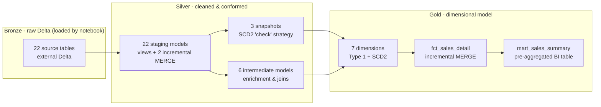
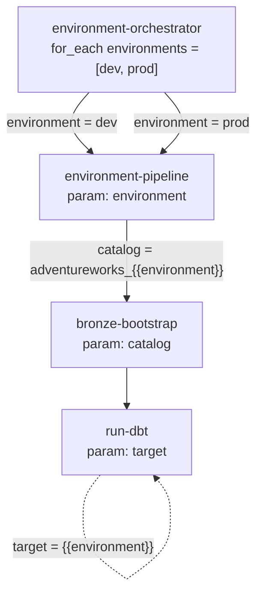

# AdventureWorks — Databricks Medallion Lakehouse with dbt

An end-to-end, production-shaped implementation of the **AdventureWorks 2025** sample database as a **Bronze → Silver → Gold medallion lakehouse** on **Databricks Free Edition**, built with **dbt Core** and the **dbt-databricks** adapter.

This project is built to reflect patterns commonly used in real-world data warehouses,  including a Kimball star schema, SCD Type 2 history, incremental `MERGE` loads, a data-quality test suite, and environment-specific schema isolation. The goal is to showcase the kinds of design and engineering decisions you would typically encounter in a production analytics platform.

---

## What this project demonstrates

| Capability | Where it shows up |
|------------|-------------------|
| **Medallion architecture** | `models/bronze` (sources) → `models/silver` (staging + intermediate) → `models/gold` (dims, facts, marts) |
| **Dimensional modelling (Kimball)** | 7 conformed dimensions, a fact at sales-order-line grain, a pre-aggregated BI mart |
| **Slowly Changing Dimensions (Type 2)** | dbt snapshots + SCD2 dimensions for Product, Employee, SalesTerritory, with surrogate/business-key separation and an "Unknown member" safety net |
| **Point-in-time attribution** | Fact joins to the dimension version that was current when each order was placed |
| **Incremental processing** | `MERGE`-based incremental models for high-volume order header/detail and the fact table |
| **Advanced modelling patterns** | Junk dimension for low-cardinality flags, allocated semi-additive measures (freight/tax) at line grain |
| **Testing as a data contract** | 558 tests — built-ins, `dbt_utils`, `dbt_expectations`, a custom SCD2 overlap test, and singular reconciliation tests |
| **Engineering for multiple environments** | Custom `generate_schema_name` macro isolates `dev`, `ci`, and `prod` into separate schemas without collisions |
| **Self-bootstrapping ingestion** | A single Databricks notebook downloads the raw CSVs and lands them as Delta in Bronze |
| **Observability & docs** | `on-run-start`/`on-run-end` hooks, `persist_docs` to Unity Catalog, and a browsable `dbt docs` lineage site |

---

## Architecture



| Layer | Contents | Materialisation |
|-------|----------|-----------------|
| **Bronze** | 22 source tables | external Delta (loaded by `bronze_bootstrap.ipynb`) |
| **Silver** | 22 staging + 6 intermediate | `view` + 2 incremental `MERGE` (`stg_sales_order_header`, `stg_sales_order_detail`) |
| **Snapshots** | 3 (Product, Employee, SalesTerritory) | dbt snapshot, `check` strategy |
| **Gold** | 7 dims, 1 fact, 1 mart | `table` + incremental `MERGE` on the fact |
| **Tests** | 558 | built-in + `dbt_utils` + `dbt_expectations` + 1 custom + 3 singular |

---

## Tech stack

- **dbt Core** with the **dbt-databricks** adapter (tested on dbt-core 1.11 / dbt-databricks 1.12; `dbt-databricks>=1.10` is recommended)
- **Databricks Free Edition** — serverless SQL warehouse + Unity Catalog
- **Delta Lake** storage format throughout
- dbt packages: [`dbt_utils`](https://github.com/dbt-labs/dbt-utils), [`dbt_expectations`](https://github.com/calogica/dbt-expectations), [`codegen`](https://github.com/dbt-labs/dbt-codegen)

---

## Project structure

```text
adventureworks-databricks-medallion-dbt/
├── dbt_project.yml          # project config, materialisations, persist_docs, hooks
├── packages.yml             # dbt_utils, dbt_expectations, codegen
├── profiles.yml             # committed to the repo — all values use env_var(), no secrets hard-coded
├── macros/
│   ├── generate_schema_name.sql      # dev/ci/prod schema isolation
│   └── test_scd2_no_date_overlap.sql # custom SCD2 integrity test
├── models/
│   ├── bronze/              # _sources_*.yml only (Bronze is loaded by notebook)
│   ├── silver/
│   │   ├── staging/         # 1:1 cleaned views over sources
│   │   └── intermediate/    # joins & enrichment
│   └── gold/
│       ├── dimensions/      # 7 dims (Type 1 + SCD2)
│       ├── facts/           # fct_sales_detail
│       └── marts/           # mart_sales_summary
├── snapshots/               # SCD2 snapshots for Product/Employee/SalesTerritory
├── tests/                   # singular (cross-model) tests
├── notebooks/
│   ├── bronze_bootstrap.ipynb   # downloads CSVs → lands Bronze Delta tables
│   ├── run_dbt.ipynb            # runs `dbt build` from a Databricks Job
│   └── scd_data_generator.ipynb # mutates source rows to exercise SCD2
├── databricks.yml           # Databricks Asset Bundle descriptor (4 jobs)
├── resources/               # *.job.yml definitions globbed by the bundle
├── .github/workflows/
│   └── databricks-bundle.yml        # CI/CD: validate + deploy the bundle
└── docs/
    ├── databricks-jobs-ui.md           # wire the 4 jobs up by hand (Workflows UI)
    ├── databricks-asset-bundle.md      # deploy the 4 jobs via the Databricks CLI
    └── databricks-cicd-github-actions.md # GitHub Actions CI/CD design & setup
```

---

## Prerequisites

- A **Databricks Free Edition** account — sign up at <https://www.databricks.com/learn/free-edition>. You get a serverless SQL warehouse and Unity Catalog at no cost.
- **Python 3.10 – 3.13** (3.12 recommended).
- **Git**.
- A terminal: **PowerShell** on Windows, or **bash/zsh** on macOS/Linux.

---

## Getting started

The steps below take you from a clean machine to a fully built, tested
warehouse. Commands are shown for **Windows PowerShell** and **macOS/Linux
bash**.

### 1. Set up Databricks and collect the required connection details

In your Databricks Free Edition workspace:

1. **Create a SQL Warehouse** (or use the default serverless warehouse).
   Open the warehouse → **Connection details** and record:

   * **Server hostname** — e.g. `dbc-xxxxxxxx-xxxx.cloud.databricks.com`
     *(Do not include `https://` or a trailing `/`.)*

   * **HTTP path** — e.g. `/sql/1.0/warehouses/abc123def456`

2. **Create a Personal Access Token (PAT):**
   Go to **Avatar → Settings → Developer → Access tokens → Generate new token**.
   Copy the `dapi...` value immediately — it is only displayed once.

You now have the three values dbt needs to connect to Databricks:

* `host`
* `http_path`
* `token`

### 2. Clone the repo

```bash
git clone https://github.com/hjtc365/adventureworks-databricks-medallion-dbt.git
cd adventureworks-databricks-medallion-dbt
```

### 3. Install Python and verify it works

dbt Core is a Python application, so Python needs to be installed before you
create the project's virtual environment. Use **Python 3.11** if you have the
choice; it is the safest version for compatibility across dbt and Databricks
tooling.

First, check whether Python is already installed:

**Windows PowerShell**

```powershell
py --list
python --version
```

**macOS / Linux**

```bash
python3 --version
```

You want to see a Python version in the **3.10 - 3.13** range. If you already
have **3.12.x**, keep it and move on.

If Python is not installed:

**Windows**

- Install it from <https://www.python.org/downloads/>.
- During setup, check **Add Python to PATH**.
- After install, open a new PowerShell window and re-run `python --version`.

**macOS**

```bash
brew install python@3.12
echo 'export PATH="/opt/homebrew/opt/python@3.12/bin:$PATH"' >> ~/.zshrc
source ~/.zshrc
python3.12 --version
```

**Ubuntu / Debian**

```bash
sudo apt update
sudo apt install python3.12 python3.12-venv
python3.12 --version
```

If the version command works, Python is installed correctly and you can create
the project venv.

### 4. Create and activate a Python virtual environment

A virtual environment keeps this project's packages isolated from your system
Python.

**Windows PowerShell**

```powershell
py -3.12 -m venv .venv
.\.venv\Scripts\Activate.ps1
```

> If PowerShell blocks the activate script with *"running scripts is disabled
> on this system"*, relax the policy for the current session only:
> `Set-ExecutionPolicy -Scope Process -ExecutionPolicy RemoteSigned`, then
> re-run the activate command.

**macOS / Linux**

```bash
python3.12 -m venv .venv
source .venv/bin/activate
```

Your prompt should now show the `(.venv)` prefix. Re-activate every time you
open a new terminal.

### 5. Install dbt

Install **only** the adapter — it pulls in the matching `dbt-core`
automatically. Never pin `dbt-core` separately.

```bash
python -m pip install --upgrade pip
pip install "dbt-databricks==1.12.*"
```

Verify:

```bash
dbt --version
```

### 6. Install dbt package dependencies

```bash
dbt deps
```

This downloads `dbt_utils`, `dbt_expectations`, and `codegen` into
`dbt_packages/` (git-ignored).

### 7. Configure `profiles.yml`

`profiles.yml` describes **how dbt connects to Databricks**. It is already
present in the **repo root** and is safe to commit to source control because
every sensitive value is read from an environment variable at runtime using
dbt's `env_var()` function — no credentials are hard-coded in the file.

Open `profiles.yml` and verify the contents look like this:

```yaml
adventureworks:
  target: dev
  outputs:
    dev:
      type: databricks
      catalog: adventureworks_dev
      schema: default
      host: "{{ env_var('DBT_DBX_HOST') }}"
      http_path: "{{ env_var('DBT_DBX_HTTP_PATH') }}"
      token: "{{ env_var('DBT_DBX_TOKEN') }}"
      threads: 4
    prod:
      type: databricks
      catalog: adventureworks_prod
      schema: default
      host: "{{ env_var('DBT_DBX_HOST') }}"
      http_path: "{{ env_var('DBT_DBX_HTTP_PATH_PROD') }}"
      token: "{{ env_var('DBT_DBX_TOKEN') }}"
      threads: 8
```

No changes are needed. dbt locates `profiles.yml` by checking the current
working directory before falling back to `~/.dbt/`, so running dbt from the
repo root (which `dbt build`, `dbt debug`, etc. all do by default) is enough
— no `--profiles-dir` flag required.

> The profile name `adventureworks` must match `profile: 'adventureworks'` in
> `dbt_project.yml`. The only difference between `dev` and `prod` is the
> **catalog** — same warehouse, different Unity Catalog catalog, so dev
> experiments never touch production data.

### 8. Set environment variables

dbt reads your Databricks credentials and your developer name from environment
variables at runtime. `DBT_USER` is consumed by the `generate_schema_name`
macro to prefix your dev schemas (e.g. `alice_silver`) so multiple developers
never collide in the shared dev catalog.

> **Replace every placeholder value below with your own before running.**
> - `dbc-xxxxxxxx-xxxx.cloud.databricks.com` → your workspace **Server hostname** (no `https://`, no trailing `/`)
> - `/sql/1.0/warehouses/abc123def456` → your SQL Warehouse **HTTP path**
> - `dapiXXXX...` → your **Personal Access Token** (the `dapi…` string from Step 1)
> - `alice` → your chosen **dbt user prefix** (used to name your dev schemas, e.g. `alice_silver`)

**Windows PowerShell — current session**

```powershell
$env:DBT_DBX_HOST           = "dbc-xxxxxxxx-xxxx.cloud.databricks.com"
$env:DBT_DBX_HTTP_PATH      = "/sql/1.0/warehouses/abc123def456"
$env:DBT_DBX_HTTP_PATH_PROD = "/sql/1.0/warehouses/abc123def456"
$env:DBT_DBX_TOKEN          = "dapiXXXXXXXXXXXXXXXXXXXXXXXXXXXXXXXX"
$env:DBT_USER               = "alice"
```

To persist them across PowerShell sessions, use
`[Environment]::SetEnvironmentVariable`:

```powershell
[Environment]::SetEnvironmentVariable('DBT_DBX_HOST', 'dbc-xxxxxxxx-xxxx.cloud.databricks.com', 'User')
[Environment]::SetEnvironmentVariable('DBT_DBX_HTTP_PATH', '/sql/1.0/warehouses/abc123def456', 'User')
[Environment]::SetEnvironmentVariable('DBT_DBX_HTTP_PATH_PROD', '/sql/1.0/warehouses/abc123def456', 'User')
[Environment]::SetEnvironmentVariable('DBT_DBX_TOKEN', 'dapiXXXXXXXXXXXXXXXXXXXXXXXXXXXXXXXX', 'User')
[Environment]::SetEnvironmentVariable('DBT_USER', 'alice', 'User')
```

**macOS / Linux — current session**

```bash
export DBT_DBX_HOST="dbc-xxxxxxxx-xxxx.cloud.databricks.com"
export DBT_DBX_HTTP_PATH="/sql/1.0/warehouses/abc123def456"
export DBT_DBX_HTTP_PATH_PROD="/sql/1.0/warehouses/abc123def456"
export DBT_DBX_TOKEN="dapiXXXXXXXXXXXXXXXXXXXXXXXXXXXXXXXX"
export DBT_USER="alice"
```

To persist, add those `export` lines to `~/.bashrc` or `~/.zshrc` and reload
the shell.

> **Never commit your token.** If a PAT is ever exposed, rotate it immediately
> in Databricks — git history retains old values forever.

### 9. Verify the connection

```bash
dbt debug
```

You want `All checks passed!`. If you see *"Env var required but not
provided"*, your environment variables aren't set in the current shell. If you
see *"Could not find profile"*, check the profile name in `profiles.yml`.

### 10. Load the Bronze layer (one-time)

dbt does **not** own ingestion — Bronze is loaded by a notebook. Import
`notebooks/bronze_bootstrap.ipynb` into your Databricks workspace and run it.
It will:

1. Create the catalog, the `bronze` schema, and a `landing` volume.
2. Download the AdventureWorks CSV exports and land them as **external Delta
   tables** (all columns as `STRING` — typing happens in Silver).

Set the notebook's `catalog` widget to `adventureworks_dev` for your dev build
(and re-run with `adventureworks_prod` if you want a prod catalog too).

> Optional: `notebooks/scd_data_generator.ipynb` mutates a few source rows so
> you can watch SCD2 snapshots capture history on subsequent runs.

### 11. Build and test the warehouse

```bash
dbt build
```

`dbt build` runs every model **and** its tests in dependency order, stopping a
branch as soon as an upstream test fails. On success you'll see all Silver and
Gold models materialise into your `<DBT_USER>_silver` / `<DBT_USER>_gold`
schemas, followed by ~558 passing tests.

Useful variations:

```bash
dbt build --select gold                 # just the Gold layer + its tests
dbt build --select +fct_sales_detail    # the fact and everything it depends on
dbt test                                # run the test suite only
dbt build --target prod                 # build into the prod catalog
```

---

## Multi-environment schema isolation

The custom `macros/generate_schema_name.sql` routes every model into an
environment-specific schema so `dev`, `ci`, and `prod` never collide:

| Target | Schema pattern | Example |
|--------|----------------|---------|
| `dev` | `<DBT_USER>_<layer>` | `alice_silver`, `alice_gold` |
| `ci` | `pr_<PR_NUMBER>_<layer>` | `pr_42_silver` |
| `prod` | `<layer>` (no prefix) | `silver`, `gold` |

This is what lets a whole team share one `adventureworks_dev` catalog, and what
makes pull-request CI builds disposable (drop `pr_42_*` after merge).

---

## Automating builds with Databricks Jobs

The two notebooks (`bronze_bootstrap` and `run_dbt`) can be wired together as
Databricks Jobs so that a **single click loads both `dev` and `prod`** end to
end. The setup uses **four jobs** arranged in a layered hierarchy: two *leaf*
jobs that each wrap one notebook, a *pipeline* job that chains them for one
environment, and an *orchestrator* job that fans the pipeline out across every
environment.



| Job | Role | Runs | Key parameter |
|-----|------|------|---------------|
| **bronze-bootstrap** | leaf | `notebooks/bronze_bootstrap` | `catalog` (default `adventureworks_dev`) |
| **run-dbt** | leaf | `notebooks/run_dbt` | `target` (default `dev`) |
| **environment-pipeline** | chains the two leaves for one env | bronze-bootstrap → run-dbt | `environment` (default `dev`) |
| **environment-orchestrator** | fans the pipeline across all envs | environment-pipeline per env | `environments` (default `["dev", "prod"]`) |

Running **environment-orchestrator** once loops `dev` then `prod`, each time
bootstrapping Bronze into `adventureworks_<env>` and then running
`dbt build --target <env>`.

There are two ways to create these four jobs — pick whichever fits your
workflow:

| Approach | When to use it | Guide |
|----------|----------------|-------|
| **Workflows UI** | One-off setup, learning the moving parts, no CLI required | **[docs/databricks-jobs-ui.md](docs/databricks-jobs-ui.md)** |
| **Databricks Asset Bundle** | Version-controlled, reproducible across workspaces, CI/CD | **[docs/databricks-asset-bundle.md](docs/databricks-asset-bundle.md)** |

Both produce the same jobs. The bundle is already defined in this repo
([`databricks.yml`](databricks.yml) + [`resources/*.job.yml`](resources/)), so
deploying it is just `databricks bundle deploy`. The bundle guide also covers
authenticating the CLI with a `~/.databrickscfg` **host + token** profile as an
alternative to browser-based OAuth login.

> Both approaches run the `run_dbt` notebook, which reads its credentials from a
> Databricks Secret scope named `aw`. Creating that scope is **Step 1** in each
> guide and must be done before the jobs run.

### Continuous deployment with GitHub Actions

The repo also ships a CI/CD pipeline
([`.github/workflows/databricks-bundle.yml`](.github/workflows/databricks-bundle.yml))
that **validates the bundle on every pull request** and **auto-deploys** it with
the Databricks CLI — to **dev** on pushes to `feature/`, `bugfix/`, or `hotfix/`
branches, and to **prod** (behind a manual approval gate) on merges to `main`.

See **[docs/databricks-cicd-github-actions.md](docs/databricks-cicd-github-actions.md)**
for the design, the branching model, and how to configure the required GitHub
secrets and the `production` approval environment.

---

## Browse the lineage docs

```bash
dbt docs generate
dbt docs serve
```

This opens an interactive site at `http://localhost:8080` with the full model
lineage graph, per-model compiled SQL, column-level documentation, and test
coverage. With `persist_docs` enabled in `dbt_project.yml`, the same column
descriptions are pushed into Unity Catalog as `COMMENT`s.

---

## License

MIT
