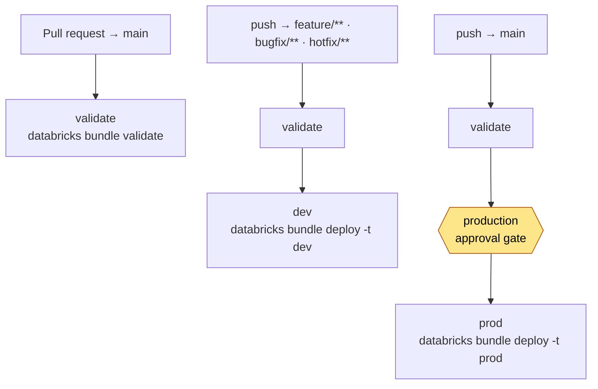

# CI/CD with GitHub Actions

This project ships a GitHub Actions workflow,
[`.github/workflows/databricks-bundle.yml`](../.github/workflows/databricks-bundle.yml),
that **validates the Databricks Asset Bundle on every change** and **deploys it
automatically** to the right workspace based on the branch you push to.

> New to the bundle itself? Read
> **[Deploying the jobs as a Databricks Asset Bundle](databricks-asset-bundle.md)**
> first — this guide automates the exact `databricks bundle validate` /
> `databricks bundle deploy` commands documented there.

---

## What the pipeline does



| Event | `validate` | `dev` deploy | `prod` deploy |
|-------|:----------:|:------------:|:-------------:|
| **PR → `main`** | ✅ | — | — |
| **push → `feature/**`, `bugfix/**`, `hotfix/**`** | ✅ | ✅ | — |
| **push → `main`** | ✅ | — | ✅ *(after approval)* |

The pipeline is **deploy-only**: it creates and updates the four job
*definitions* in the workspace (`bronze-bootstrap`, `run-dbt`,
`environment-pipeline`, `environment-orchestrator`). It does **not** trigger a
run — see [Deploy vs. run](#deploy-vs-run) below.

---

## Job-by-job breakdown

### `validate` — always runs

```yaml
- uses: databricks/setup-cli@v1.4.0
- name: Write dev profile        # [dev] from DATABRICKS_*_DEV secrets
  run: |
    umask 077
    printf '[dev]\nhost = %s\ntoken = %s\n' '…' '…' > ~/.databrickscfg
- run: databricks bundle validate -t dev
```

Installs the v0.205+ Databricks CLI and lints the bundle: it parses
`databricks.yml`, expands every `resources/*.job.yml`, resolves
`${resources.jobs.*.id}` and `${workspace.current_user.userName}` references,
and fails the check if anything is malformed. Because it runs on **pull
requests**, a broken bundle is caught **before** it can merge to `main`.

It authenticates with the **dev** credentials (the `[dev]` profile it writes
from the dev secrets), so validation targets the `dev` target.

### `dev` — deploy feature work

```yaml
if: >
  github.event_name == 'push' && (
    startsWith(github.ref, 'refs/heads/feature/') ||
    startsWith(github.ref, 'refs/heads/bugfix/')  ||
    startsWith(github.ref, 'refs/heads/hotfix/'))
needs: validate
run: databricks bundle deploy -t dev
```

Runs only after `validate` passes, and only on a push to a `feature/`,
`bugfix/`, or `hotfix/` branch. It deploys the bundle to the **dev** workspace
with `mode: development`, so the jobs land prefixed (`[dev <user>]`) and
paused — safe to iterate on without touching production.

### `prod` — deploy on merge to `main`

```yaml
if: github.ref == 'refs/heads/main' && github.event_name == 'push'
needs: validate
environment: production   # 🔒 approval gate
steps:
  - name: Write prod profile     # [prod] from DATABRICKS_*_PROD secrets
    run: |
      umask 077
      printf '[prod]\nhost = %s\ntoken = %s\n' '…' '…' > ~/.databrickscfg
  - run: databricks bundle deploy -t prod
```

Runs only on a push to `main` (i.e. when a PR merges). The
`environment: production` line ties this job to a **GitHub Environment**, which
lets you require a **manual approval** before it proceeds. It writes a `[prod]`
profile from the **prod** secrets and deploys with `mode: production`, so the
jobs land with their real names, schedules, and triggers active.

---

## How authentication works

The bundle's targets authenticate by **profile name**, not by URL —
[`databricks.yml`](../databricks.yml) declares `profile: dev` and `profile: prod`
instead of hard-coded hosts, so the workspace URLs stay out of source control.

The CLI loads those profiles from `~/.databrickscfg`. A GitHub runner has no
such file, so **each job writes the profile it needs from secrets** before
running any bundle command:

```yaml
- name: Write dev profile
  run: |
    umask 077
    printf '[dev]\nhost = %s\ntoken = %s\n' \
      '${{ secrets.DATABRICKS_HOST_DEV }}' \
      '${{ secrets.DATABRICKS_TOKEN_DEV }}' > ~/.databrickscfg
```

The `validate` and `dev` jobs write a `[dev]` profile from the dev secrets; the
`prod` job writes a `[prod]` profile from the prod secrets. Then
`databricks bundle deploy -t dev` / `-t prod` resolves to the matching profile.

> **The profile names must match `databricks.yml`.** The written section header
> (`[dev]` / `[prod]`) has to equal the target's `profile:` value, and its
> `host` must point at the workspace that target should deploy to:
>
> - `[dev]` ↔ `targets.dev.workspace.profile: dev`, host = `DATABRICKS_HOST_DEV`
> - `[prod]` ↔ `targets.prod.workspace.profile: prod`, host = `DATABRICKS_HOST_PROD`
>
> `umask 077` ensures the file is created with owner-only permissions, and
> GitHub masks the secret values in logs.

> **Why write a file instead of using `DATABRICKS_HOST`/`DATABRICKS_TOKEN`
> env vars?** Because the targets use a `profile:` mapping, the CLI expects a
> named profile and won't fall back to those env vars. If you'd rather use the
> simpler env-var style in CI, swap each target's `profile:` back to a `host:`
> in `databricks.yml` and set `DATABRICKS_HOST`/`DATABRICKS_TOKEN` per job.

---

## One-time setup

### 1. Create a token in each workspace

In **each** workspace (dev and prod), generate a Personal Access Token via
**Avatar → Settings → Developer → Access tokens → Generate new token**.

> For a team or production setup, prefer a **service principal** token over a
> personal PAT, so deployments are not tied to one person's account. Create a
> service principal, grant it `CAN_MANAGE` on the jobs (or workspace admin), and
> use its OAuth secret / token.

### 2. Add the four repository secrets

In GitHub: **Settings → Secrets and variables → Actions → New repository
secret**. Add:

| Secret | Value |
|--------|-------|
| `DATABRICKS_HOST_DEV` | Dev workspace URL, e.g. `https://dbc-xxxxxxxx-xxxx.cloud.databricks.com` (becomes the `host` in the written `[dev]` profile) |
| `DATABRICKS_TOKEN_DEV` | PAT for the dev workspace (`dapi…`) |
| `DATABRICKS_HOST_PROD` | Prod workspace URL (becomes the `host` in the written `[prod]` profile) |
| `DATABRICKS_TOKEN_PROD` | PAT for the prod workspace (`dapi…`) |

> These are full *workspace* URLs **with** the `https://` scheme — that is what
> a `.databrickscfg` `host` entry expects. The `databricks.yml` targets
> reference these workspaces by **profile name** (`profile: dev` / `profile:
> prod`), so the URLs live only in these secrets, never in the repo.

### 3. Create the `production` Environment (approval gate)

In GitHub: **Settings → Environments → New environment → `production`**. Under
**Deployment protection rules**, enable **Required reviewers** and add yourself
(or the release approvers). Now every push to `main` pauses the `prod` job until
a reviewer approves it in the **Actions** tab.

> The name **must** be exactly `production` to match `environment: production`
> in the workflow.

### 4. Pre-create the `aw` secret scope in each workspace

The workflow deploys job *definitions* but does **not** create the Databricks
Secret scope the `run_dbt` notebook needs at run time. Create the `aw` scope in
**both** the dev and prod workspaces once, as described in
[the bundle guide, Step 3](databricks-asset-bundle.md#3-create-the-aw-secret-scope-required-by-run_dbt).

### 5. (Recommended) Protect `main`

In **Settings → Branches**, add a branch protection rule for `main` that
requires the **Validate Bundle** check to pass before merging. That makes the
PR-time `validate` job a true merge gate.

---

## Deploy vs. run

This is the most important thing to understand about the pipeline:

- **Deploy** (`databricks bundle deploy`) uploads the notebooks and *creates or
  updates the job definitions* in the workspace. It does **not** execute them.
- **Run** (`databricks bundle run`) actually triggers a job.

So after a successful pipeline, the four jobs exist and are up to date, but no
data has been loaded yet. To actually load the warehouse you either:

- trigger **environment-orchestrator** manually (UI or
  `databricks bundle run environment_orchestrator`), or
- give the jobs a schedule in their `*.job.yml`, or
- add a run step to the workflow, e.g. append to the `prod` job:

  ```yaml
  - name: Run the orchestrator
    run: databricks bundle run environment_orchestrator -t prod
  ```

Keeping deploy and run separate is deliberate: CI ships *definitions* on every
merge, while *when data loads* stays an explicit, controlled decision.

---

## Branching model

| Branch pattern | Intent | Pipeline effect |
|----------------|--------|-----------------|
| `feature/*` | New models, tests, features | Validate + deploy to **dev** |
| `bugfix/*` | Fixes to existing behaviour | Validate + deploy to **dev** |
| `hotfix/*` | Urgent production-shaped fixes | Validate + deploy to **dev** |
| `main` | Released, reviewed code | Validate + deploy to **prod** (gated) |
| *(any PR → `main`)* | Code under review | Validate only |

The flow is: branch off `main` → push (auto-deploys to dev) → open a PR
(validate gate) → merge → prod deploy waits for approval.

---

## Notes & limitations

- **Shared dev identity.** Every `feature/bugfix/hotfix` branch deploys with the
  *same* dev token, so under `mode: development` they share one `[dev <user>]`
  prefix and successive pushes overwrite each other's dev jobs. That is fine for
  a solo project; for a team, consider a
  [`concurrency`](https://docs.github.com/actions/using-jobs/using-concurrency)
  block or per-developer targets to avoid clobbering.
- **Forked PRs have no secrets.** `validate` needs the dev credentials; pull
  requests from forks don't receive repository secrets, so validation there will
  fail to authenticate. This repo's flow assumes branches live in the same repo.
- **Pinned actions.** `actions/checkout` and `databricks/setup-cli@v1.4.0` are
  version-pinned for reproducible, supply-chain-safe runs. Bump them
  deliberately.

---

## Troubleshooting

| Symptom | Likely cause | Fix |
|---------|--------------|-----|
| `Error: cannot resolve profile dev` / `profile not found` | The `Write … profile` step didn't run, or the section header doesn't match the target's `profile:`. | Ensure the profile step runs before the bundle command and writes `[dev]`/`[prod]` to match `databricks.yml`. |
| Deploy hits the wrong workspace | The `DATABRICKS_HOST_*` secret points at the wrong workspace. | Update the secret to the correct workspace URL (with `https://`). |
| `Error: authentication failed` / `403` | Token expired, revoked, or lacks job-manage permission. | Regenerate the PAT (or service-principal token) and update the secret. |
| `prod` job never starts | The `production` Environment isn't approved, or its name differs. | Approve the run in **Actions**, and confirm the Environment is named exactly `production`. |
| `validate` fails on `${resources.jobs.*.id}` | A `resources/*.job.yml` references a job that doesn't exist or is misspelled. | Fix the reference; run `databricks bundle validate` locally to reproduce. |
| Jobs deploy but nothing loads | Pipeline is deploy-only. | Trigger `environment-orchestrator`, add a schedule, or add a `bundle run` step ([Deploy vs. run](#deploy-vs-run)). |
| `SecretNotFound: ... scope: aw` when a job runs | `aw` scope missing in that workspace. | Create it in the dev **and** prod workspaces (setup Step 4). |
