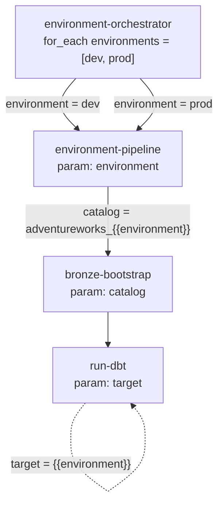

# Automating builds with Databricks Jobs (Workflows UI)

This guide wires the two project notebooks (`bronze_bootstrap` and `run_dbt`)
together as Databricks Jobs **by hand in the Workflows UI**, so that a single
click loads both `dev` and `prod` end to end.

> Prefer version-controlled, reproducible deployments? Use the
> **[Databricks Asset Bundle](databricks-asset-bundle.md)** instead — it
> declares the same four jobs in code and deploys them with the Databricks CLI.

---

## The job hierarchy

The setup uses **four jobs** arranged in a layered hierarchy: two *leaf* jobs
that each wrap one notebook, a *pipeline* job that chains them for one
environment, and an *orchestrator* job that fans the pipeline out across every
environment.



| Job | Role | Runs | Key parameter |
|-----|------|------|---------------|
| **bronze-bootstrap** | leaf | `notebooks/bronze_bootstrap` | `catalog` (default `adventureworks_dev`) |
| **run-dbt** | leaf | `notebooks/run_dbt` | `target` (default `dev`) |
| **environment-pipeline** | chains the two leaves for one env | bronze-bootstrap → run-dbt | `environment` (default `dev`) |
| **environment-orchestrator** | fans the pipeline across all envs | environment-pipeline per env | `environments` (default `["dev", "prod"]`) |

### How the parameters flow

1. **environment-orchestrator** holds a JSON array parameter `environments`
   (default `["dev", "prod"]`) and uses a **`for_each` task** to run
   **environment-pipeline** once per element, passing each value through as
   `environment = {{input}}`.
2. **environment-pipeline** receives a single `environment` and runs the two
   leaf jobs in order:
   - **bronze-bootstrap** with `catalog = adventureworks_{{environment}}`
   - **run-dbt** with `target = {{environment}}` (only after bronze-bootstrap
     succeeds — see `depends_on`)
3. The leaf jobs hand those values straight to the notebook widgets
   (`catalog` and `target`), so the same notebooks serve every environment.

This is why building both catalogs is one action: run
**environment-orchestrator** and it loops `dev` then `prod`, each time
bootstrapping Bronze into `adventureworks_<env>` and then running
`dbt build --target <env>`.

---

## Step 1 — Create the `aw` Databricks Secret scope

The `run_dbt` notebook reads four values from a Databricks Secret scope named
`aw`. The scope must exist **before** any of the jobs run, otherwise the
`run-dbt` task fails with `SecretNotFound`.

You need the **v0.205+ Databricks CLI** for this (the new Go-based CLI, not
the legacy `pip install databricks-cli` package). Install once:

```bash
# Windows
winget install Databricks.DatabricksCLI

# macOS
brew tap databricks/tap && brew install databricks

# Linux / other
curl -fsSL https://raw.githubusercontent.com/databricks/setup-cli/main/install.sh | sh
```

Authenticate against your workspace (opens a browser):

```bash
databricks auth login --host https://dbc-xxxxxxxx-xxxx.cloud.databricks.com
```

> Already keep `host`/`token` in a `~/.databrickscfg` profile? The CLI will use
> it automatically — pass `-p <profile>` to the `databricks secrets` commands
> below instead of running `auth login`. See the
> [Asset Bundle guide](databricks-asset-bundle.md#authenticate-the-cli) for how
> to set that file up.

Create the scope and populate the four keys. Values are sent over TLS and
never echoed back to the terminal.

```bash
databricks secrets create-scope aw

databricks secrets put-secret aw host       --string-value "dbc-xxxxxxxx-xxxx.cloud.databricks.com"
databricks secrets put-secret aw http_path  --string-value "/sql/1.0/warehouses/abc123def456"
databricks secrets put-secret aw dbt_token  --string-value "dapiXXXXXXXXXXXXXXXXXXXXXXXXXXXXXXXX"
databricks secrets put-secret aw dbt_user   --string-value "<your-dbt-user-prefix>"
```

Verify:

```bash
databricks secrets list-scopes
databricks secrets list-secrets aw   # should list: host, http_path, dbt_token, dbt_user
```

| Secret key | Value to supply |
|------------|-----------------|
| `host` | Workspace **Server hostname** — no `https://`, no trailing `/` |
| `http_path` | SQL Warehouse **HTTP path** from **Connection details** |
| `dbt_token` | Your Databricks **Personal Access Token** (`dapi…`) |
| `dbt_user` | Your dbt user prefix — the `generate_schema_name` macro uses this to isolate dev schemas (e.g. `alice` → `alice_silver`, `alice_gold`) |

---

## Step 2 — Clone the repo as a Databricks Git folder

Databricks now recommends creating Git folders from your **home folder** rather
than under the legacy `/Repos` path:

1. In the workspace UI, navigate to **Workspace → Home**.
2. Click **Create → Git folder** (top-right button).
3. Paste the HTTPS URL of your fork:
   `https://github.com/<your-github-username>/adventureworks-databricks-medallion-dbt.git`
4. Leave the folder name as-is and click **Create Git folder**.

This clones the repo under
`/Workspace/Users/<you>@example.com/adventureworks-databricks-medallion-dbt`,
which is the path used in the `notebook_path` values below — adjust them if
you chose a different location.

> The legacy path **Workspace → Repos → Add repo** still works if you prefer
> it; your folder will be visible under `/Workspace/Repos/<you>@example.com/`
> instead.

---

## Step 3 — Build the four jobs in the Workflows UI

Create the jobs **bottom-up** so each parent can pick its children's job IDs
from the dropdown:

1. **bronze-bootstrap** — new Job → single **Notebook** task pointing at
   `notebooks/bronze_bootstrap`. Add a job parameter `catalog` =
   `adventureworks_dev`.
2. **run-dbt** — new Job → single **Notebook** task pointing at
   `notebooks/run_dbt`. Add a job parameter `target` = `dev`. Use a bare
   serverless environment — **do not** add `dbt-databricks` as a job
   dependency. The notebook installs its own pinned version via
   `%pip install "dbt-databricks==1.12.*"` and restarts Python, so declaring it
   at the job level is redundant and risks a version mismatch.
3. **environment-pipeline** — new Job with two **Run Job** tasks:
   - `bronze-bootstrap` → run the bronze-bootstrap job with
     `catalog = adventureworks_{{job.parameters.environment}}`.
   - `run-dbt` → **depends on** `bronze-bootstrap`, runs the run-dbt job with
     `target = {{job.parameters.environment}}`.
   - Add a job parameter `environment` = `dev`.
4. **environment-orchestrator** — new Job with one **For each** task whose
   input is `{{job.parameters.environments}}`; the nested task is a **Run Job**
   on environment-pipeline with `environment = {{input}}`. Add a job parameter
   `environments` = `["dev", "prod"]`.

---

## Step 4 — Run

Run **environment-orchestrator** to load `dev` and `prod` in one go, or run
**environment-pipeline** with `environment=dev` (or `prod`) to load a single
environment.
